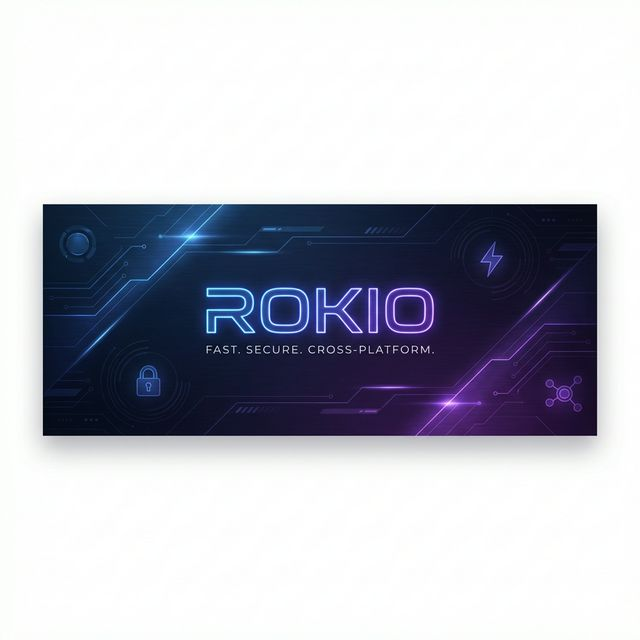
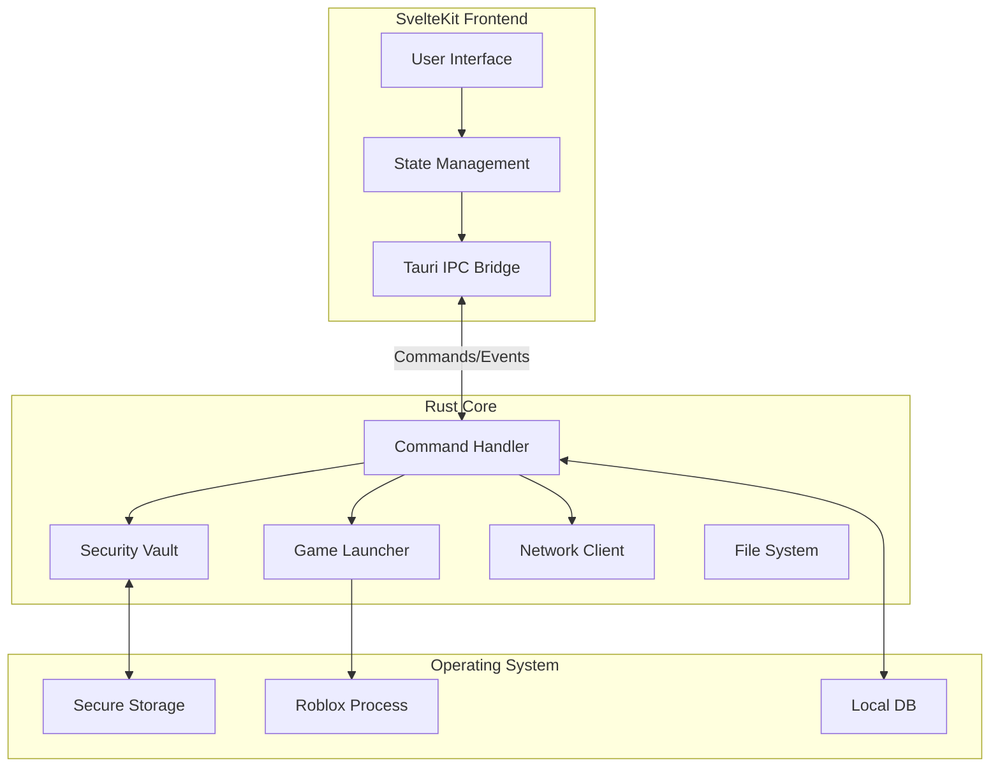

# Rokio



<div align="center">

[](https://opensource.org/licenses/MIT)
[](https://tauri.app)
[](https://kit.svelte.dev)
[](https://www.rust-lang.org)
[]()

**Fast. Secure. Cross-Platform.**
The next-generation Roblox account manager built for power users.

[Features](#features) • [Installation](#installation) • [Development](#development) • [Contributing](#contributing)

</div>

---

## Introduction

**Rokio** is a high-performance cross-platform application designed to manage multiple Roblox accounts and launch instances simultaneously. Built with **Tauri 2.0** and **Rust**, it offers native performance with a minimal memory footprint, while the **SvelteKit** frontend provides a modern, responsive user interface.

Unlike traditional managers, Rokio leverages native OS APIs for secure credential storage (Keychain/DPAPI) and uses isolated processes for multi-instance support without modifying game files.

## Key Features

- **Secure Vault**: AES-256-GCM encryption for all stored cookies and credentials.
- **Multi-Instance**: Launch unlimited Roblox clients simultaneously with unique contexts.
- **Native Performance**: <50MB RAM usage when idle, powered by Rust.
- **Cross-Platform**: First-class support for Windows, macOS, and Linux.
- **Modern UI**: Beautiful, dark-themed interface with drag-and-drop organization.
- **Server Browser**: Built-in server browser with region detection and ping stats.
- **Auto-Refresh**: Automatic cookie validation and renewal.

## Architecture

Rokio follows a hybrid architecture combining a native Rust backend with a web-based frontend context.



- **Frontend**: SvelteKit 5 + TypeScript + TailwindCSS v4
- **Backend**: Rust (Tauri Core)
- **Database**: SQLite (local metadata) + System Keychain (secrets)
- **Communication**: Asynchronous IPC based on Tauri Invoke/Event system

## Installation

### Prerequisites
- **Windows**: WebView2 (usually pre-installed on Windows 10/11)
- **macOS**: macOS 10.15+ (Catalina or newer)
- **Linux**: `webkit2gtk` and `libappindicator`

### Download
Download the latest binary for your platform from the [Releases](https://github.com/Ic0u/Rokio/releases) page.

| Platform | Installer Type | Recommended |
|----------|---------------|-------------|
| Windows  | `.msi`        | Yes         |
| macOS    | `.dmg`        | Yes         |
| Linux    | `.deb`        | Yes         |

## Development

### 1. Prerequisites
Ensure you have the following installed:
- [Node.js](https://nodejs.org/) (v20 or later)
- [Rust](https://www.rust-lang.org/tools/install) (latest stable)
- OS-specific build tools (VS Build Tools for Windows, Xcode for macOS)

### 2. Setup
Clone the repository and install dependencies:

```bash
git clone https://github.com/Ic0u/Rokio.git
cd Rokio
npm install
```

### 3. Running Locally
Start the development server with hot-reload:

```bash
npm run tauri dev
```

### 4. Environement Configuration
Create a `.env` file for development secrets (optional):

```env
PUBLIC_API_ENDPOINT=https://api.roblox.com
Example_KEY=your_key_here
```

## Project Structure

```
Rokio/
├── src/                # SvelteKit Frontend
│   ├── routes/         # App pages & routing
│   ├── lib/            # Components, stores, utilities
│   └── app.css         # Global styles (Tailwind)
├── src-tauri/          # Rust Backend
│   ├── src/
│   │   ├── main.rs     # Application entry point
│   │   ├── lib.rs      # Command exports
│   │   └── commands/   # Native implementation
│   ├── Cargo.toml      # Rust dependencies
│   └── tauri.conf.json # Tauri configuration
└── static/             # Static assets (images, fonts)
```

## Contributing

We welcome contributions! Please follow these steps:

1. **Fork** the repository.
2. Create a **feature branch**: `git checkout -b feature/amazing-feature`
3. **Commit** your changes: `git commit -m 'feat: add amazing feature'`
4. **Push** to the branch: `git push origin feature/amazing-feature`
5. Open a **Pull Request**.

Please ensure your code passes all linting and format checks:
```bash
npm run format
npm run lint
cargo fmt
```

## License

This project is licensed under the MIT License - see the [LICENSE](LICENSE) file for details.

## Roadmap

- [x] Core Account Management
- [x] Secure Vault Implementation
- [x] Multi-Instance Launcher (Windows/macOS)
- [ ] Plugin System
- [ ] Cloud Sync
- [ ] Mobile Companion App

---

<div align="center">

Built with by **Nam Nguyễn**

[Report Bug](https://github.com/Ic0u/Rokio/issues) • [Request Feature](https://github.com/Ic0u/Rokio/issues)

</div>
